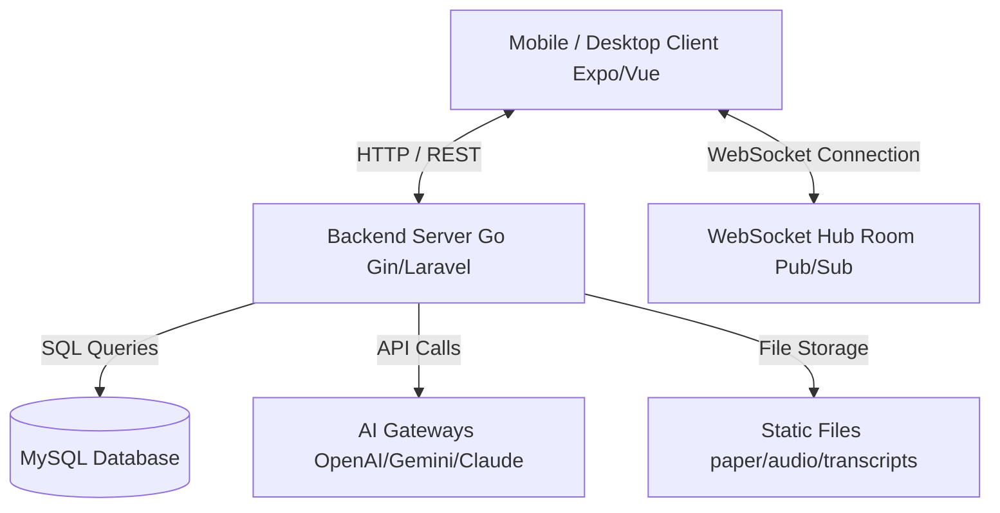

# Project Requirements Document (PRD) — TierLog Platform

This document describes the comprehensive requirements, architecture, database schemas, API endpoints, front-end layout paradigms, and AI integrations for the TierLog thesis supervision platform. It serves as a master blueprint to replicate or align similar projects across different stacks (e.g., Go/Expo to Laravel/Vue/Inertia).

---

## 1. System Architecture Overview

TierLog is designed as a high-frequency, real-time interactive platform for thesis bimbingan (supervision) between lecturers and students. The platform leverages speech-to-text transcriptions, AI-driven feedback classification, real-time messaging, and a highly customizable, desktop-like window manager layout.



### Stack Mapping
If replicating the architecture on a PHP/JS stack:
*   **Backend & Router**: Go Gin $\rightarrow$ Laravel + Inertia.js.
*   **Database ORM**: GORM $\rightarrow$ Eloquent ORM.
*   **Real-time Communication**: Go WebSocket Hub $\rightarrow$ Laravel Reverb (or Pusher/Socket.io).
*   **Frontend UI Library**: React Native Web $\rightarrow$ Vue 3 (Composition API) + TailwindCSS.
*   **Global State**: Zustand $\rightarrow$ Pinia.

---

## 2. Database Schema (MySQL)

All tables use strict foreign key constraints with `ON DELETE CASCADE` or `ON DELETE RESTRICT` to enforce data integrity at the database level.

### 2.1 Table: `users`
Represents authentication credentials and individual AI keys.
*   `id`: `bigint unsigned` (Primary Key, Auto Increment)
*   `name`: `varchar(255)` (Not Null)
*   `email`: `varchar(255)` (Unique, Not Null)
*   `password`: `varchar(255)` (Not Null)
*   `role`: `enum('student','lecturer')` (Not Null)
*   `openai_key`: `varchar(255)` (Nullable, Encrypted)
*   `gemini_key`: `varchar(255)` (Nullable, Encrypted)
*   `anthropic_key`: `varchar(255)` (Nullable, Encrypted)
*   `nvidia_key`: `varchar(255)` (Nullable, Encrypted)
*   `groq_key`: `varchar(255)` (Nullable, Encrypted)
*   `preferred_model`: `varchar(100)` (Default: `'default'`)
*   `is_gateway_active`: `boolean` (Default: `false`)
*   `created_at`: `datetime(3)`
*   `updated_at`: `datetime(3)`
*   `deleted_at`: `datetime(3)` (Index, Soft Delete)

### 2.2 Table: `refresh_tokens`
Manages user authentication sessions.
*   `id`: `bigint unsigned` (Primary Key, Auto Increment)
*   `user_id`: `bigint unsigned` (Foreign Key $\rightarrow$ `users.id`, `ON DELETE CASCADE`)
*   `token_hash`: `char(64)` (Unique Index, Not Null)
*   `expires_at`: `datetime` (Index, Not Null)
*   `revoked_at`: `datetime` (Nullable)
*   `user_agent`: `varchar(255)`
*   `ip_address`: `varchar(64)`
*   `created_at`: `datetime`
*   `updated_at`: `datetime`

### 2.3 Table: `redeem_codes`
Validates registrations for students under specific classes or lecturers.
*   `id`: `bigint unsigned` (Primary Key, Auto Increment)
*   `code`: `varchar(50)` (Unique, Not Null)
*   `is_used`: `boolean` (Default: `false`)
*   `used_by`: `bigint unsigned` (Nullable, User ID who redeemed it)
*   `created_at`: `datetime`
*   `updated_at`: `datetime`

### 2.4 Table: `lecturers`
Profile for supervisor role.
*   `id`: `bigint unsigned` (Primary Key, Auto Increment)
*   `user_id`: `bigint unsigned` (Foreign Key $\rightarrow$ `users.id`, `ON DELETE CASCADE`)
*   `nip`: `varchar(20)` (Unique, Not Null)
*   `name`: `varchar(100)` (Not Null)
*   `keahlian`: `varchar(100)`
*   `faculty`: `varchar(100)`
*   `ai_constraints`: `text` (System prompt modifications or AI constraints applied by this lecturer)
*   `created_at`: `datetime`
*   `updated_at`: `datetime`

### 2.5 Table: `students`
Profile for supervised role.
*   `id`: `bigint unsigned` (Primary Key, Auto Increment)
*   `user_id`: `bigint unsigned` (Foreign Key $\rightarrow$ `users.id`, `ON DELETE CASCADE`)
*   `lecturer_id`: `bigint unsigned` (Foreign Key $\rightarrow$ `lecturers.id`, `ON DELETE RESTRICT`)
*   `nim`: `varchar(20)` (Unique, Not Null)
*   `name`: `varchar(100)` (Not Null)
*   `prodi`: `varchar(100)`
*   `thesis_title`: `text` (Thesis topic title)
*   `created_at`: `datetime`
*   `updated_at`: `datetime`

### 2.6 Table: `consultation_logs`
Records logs for bimbingan sessions.
*   `id`: `bigint unsigned` (Primary Key, Auto Increment)
*   `student_id`: `bigint unsigned` (Foreign Key $\rightarrow$ `students.id`, `ON DELETE CASCADE`)
*   `audio_filename`: `varchar(255)` (Relative filename of uploaded consultation recording)
*   `transcript_filename`: `varchar(255)` (JSON transcript file path)
*   `transcript_text`: `longtext` (Full voice-to-text string content)
*   `paper_filename`: `varchar(255)` (Draft/thesis paper uploaded during bimbingan)
*   `final_document_filename`: `varchar(255)` (Approved final document)
*   `final_document_uploaded_at`: `datetime`
*   `revised_document_filename`: `varchar(255)` (Revised draft returned by student)
*   `revised_document_uploaded_at`: `datetime`
*   `created_at`: `datetime(3)`
*   `updated_at`: `datetime(3)`
*   `deleted_at`: `datetime(3)`

### 2.7 Table: `feedback_items`
Structured revision items assigned by lecturers to specific consultation logs.
*   `id`: `bigint unsigned` (Primary Key, Auto Increment)
*   `log_id`: `bigint unsigned` (Foreign Key $\rightarrow$ `consultation_logs.id`, `ON DELETE CASCADE`)
*   `content`: `text` (Revision instruction detail)
*   `category`: `enum('Minor','Major')` (Not Null)
*   `status`: `enum('Fixed','Pending','Validated')` (Default: `'Pending'`)
*   `fix_proof_text`: `text` (Explanation by student showing how it was resolved)
*   `created_at`: `datetime(3)`
*   `updated_at`: `datetime(3)`
*   `deleted_at`: `datetime(3)`

### 2.8 Table: `feedback_comments`
Discussion threads on specific feedback items.
*   `id`: `bigint unsigned` (Primary Key, Auto Increment)
*   `feedback_item_id`: `bigint unsigned` (Foreign Key $\rightarrow$ `feedback_items.id`, `ON DELETE CASCADE`)
*   `author_id`: `bigint unsigned` (User ID of commenter)
*   `author_role`: `enum('student','lecturer')`
*   `content`: `text`
*   `created_at`: `datetime`

### 2.9 Table: `direct_messages`
Real-time chat messages between student and lecturer.
*   `id`: `bigint unsigned` (Primary Key, Auto Increment)
*   `log_id`: `bigint unsigned` (Foreign Key $\rightarrow$ `consultation_logs.id`, `ON DELETE CASCADE`)
*   `sender_id`: `bigint unsigned` (User ID of sender)
*   `sender_role`: `enum('student','lecturer')`
*   `content`: `text`
*   `created_at`: `datetime`

### 2.10 Table: `ai_chat_messages`
Conversations with the AI Assistant inside a consultation log.
*   `id`: `bigint unsigned` (Primary Key, Auto Increment)
*   `log_id`: `bigint unsigned` (Foreign Key $\rightarrow$ `consultation_logs.id`, `ON DELETE CASCADE`)
*   `role`: `enum('user','ai')`
*   `content`: `text`
*   `created_at`: `datetime`

### 2.11 Table: `revision_annotations`
Maintains records of annotations made directly inside DOCX files or image captures.
*   `id`: `bigint unsigned` (Primary Key, Auto Increment)
*   `log_id`: `bigint unsigned` (Foreign Key $\rightarrow$ `consultation_logs.id`, `ON DELETE CASCADE`)
*   `filename`: `varchar(255)`
*   `file_type`: `enum('image','docx')`
*   `extracted_text`: `longtext`
*   `created_at`: `datetime`
*   `updated_at`: `datetime`

---

## 3. Backend Endpoints & Security Protocols

All HTTP endpoints use a JWT middleware for authentication, checking the `Authorization: Bearer <token>` header. Rate-limiting is applied to authentication attempts to protect against brute-force attacks.

### 3.1 Authentication & Profile
*   `POST /auth/register`: Register new users. Generates user records; validates students via `redeem_code`.
*   `POST /auth/login`: Authenticate email + password. Returns Access Token (short expiry) + Refresh Token.
*   `POST /auth/refresh`: Swap valid refresh token for a new access token.
*   `POST /auth/logout`: Revoke active refresh token.
*   `GET /auth/me`: Get current authenticated user profile details.
*   `GET /auth/lecturers`: List available lecturers.
*   `PATCH /settings/profile`: Update name, faculty, NIP/NIM details.
*   `PUT /settings/password`: Change account password.

### 3.2 Gateway Settings (AI Model keys)
*   `PATCH /settings/ai-gateway`: Save per-user API keys for Gemini, Claude, Groq, Nvidia, or OpenAI. Keys are stored encrypted using row-level AES-GCM encryption.
*   `POST /settings/ai-gateway/redeem`: Redeems custom promo codes to activate specific AI features.

### 3.3 Dashboard & Log Workflows
*   `GET /dashboard/stats`: Returns statistics (e.g. active student count, validated revisions rate, pending queues).
*   `GET /consultations`: Returns all logs of the active student.
*   `GET /lecturer/consultations`: Returns consultation logs assigned to the lecturer.
*   `GET /lecturer/students`: Returns list of students supervised by the lecturer.
*   `POST /consultations`: Create consultation log. Handles file uploads for audio (`audio_filename`) and papers (`paper_filename`).
*   `GET /download`: Secure download endpoint serving storage files (`/storage/audio/`, `/storage/paper/`, `/storage/revised/`, `/storage/final/`) with authentication validation.
*   `POST /consultations/:id/final-document`: Submit final thesis paper drafts.
*   `POST /consultations/:id/revised-document`: Upload revised document drafts.

### 3.4 Feedback & Communication
*   `POST /consultations/:id/add-feedback`: Lecturer adds a feedback item directly.
*   `PUT /consultations/feedback/:id/status`: Update feedback status (`Pending` $\leftrightarrow$ `Fixed` $\leftrightarrow$ `Validated`). If moving to `Fixed`, student must attach `fix_proof_text`.
*   `POST /consultations/feedback/:id/comments`: Add a comment thread to a specific feedback.
*   `GET /consultations/:id/direct-messages`: Get chat history between student and lecturer.
*   `POST /consultations/:id/direct-messages`: Send message (publishes to WebSocket room).

### 3.5 AI Engine Integrations
*   `POST /consultations/:id/classify-feedback`: Sends transcript text or document revisions to active AI API to split them into structured feedback items.
*   `POST /consultations/check-mismatch`: Verifies if the student's document content is aligned with their assigned thesis topic.
*   `POST /consultations/:id/chat`: Converses with AI Oracle using the session transcripts and thesis paper contents as system context.

### 3.6 WebSocket Server (`/ws`)
Maintains room-based publish/subscribe states for consultation logs.
*   Connect endpoint: `/ws?token=<jwt>`
*   Payload Protocol: JSON message structure:
    ```json
    { "action": "subscribe", "room": "consultation.{log_id}" }
    ```
*   **Published Events**:
    *   `feedback.new`: Emitted when lecturer creates new revision feedback.
    *   `feedback.status-updated`: Emitted when status changes to `Fixed` or `Validated`.
    *   `feedback.comment`: Emitted when a comments thread is updated.
    *   `chat.direct-message`: Emitted when a new chat message is posted.

---

## 4. Frontend Architecture & Modular Sandbox UI

The frontend is divided into two operational modes: Mobile/Tablet responsive lists, and a full-screen Desktop sandbox environment.

### 4.1 Layout Paradigms

```
+-------------------------------------------------------+
|                       NavBar                          |
+-------------------------------------------------------+
|  Heading Title              [ Roster ][ History ]...   |
+-------------------------------------------------------+
|  +-------------------+      +----------------------+  |
|  |  Student Roster   |      |   Guidance History   |  |
|  |  (Draggable Window)|     |  (Draggable Window)  |  |
|  |                   |      |                      |  |
|  +-------------------+      +----------------------+  |
|                                                       |
|  +-------------------+                                |
|  |   Advisor Chat    |                                |
|  |  (Draggable Window)|                                |
|  +-------------------+                                |
+-------------------------------------------------------+
```

1.  **Mobile View**: Uses vertical scroll containers and a segmented tab navigation system at the top (`Roster`, `Overview`, `Revisions`, `Chat`) to render isolated cards.
2.  **Tablet View**: Split-screen two-column interface (Left column: Student Roster; Right column: Details panel with sub-navigation switcher).
3.  **Desktop Fullscreen Sandbox (Windows Manager)**:
    *   Toggles on the Page wrapper to enable full viewport width (`fullWidth={true}`) and non-scrollable height (`scrollable={false}`).
    *   An absolute-positioned canvas area fills `100%` width and height of the screen below the navigation/toolbar block.
    *   All tools are packaged as floating windows (`WindowPanel` elements) absolute-positioned on this canvas with variables: `x`, `y`, `w`, `h`, and `zIndex`.
    *   **Window Title Bar Controls**:
        *   **Drag-to-Move**: Triggered on `onMouseDown` on the header, track `clientX`/`clientY` mouse move differences, and update relative coordinates `x` and `y`.
        *   **Drag-to-Resize**: Triggered on bottom-right corner resize handle, modifying `w` and `h` states.
        *   **Z-Index Focus**: Focus raises the panel to the foreground by updating its `zIndex` to `maxZIndex + 1`.
        *   **Maximize/Restore**: Toggles window style between float coordinates and `left: 0, top: 0, width: '100%', height: '100%'`.
        *   **Minimize/Close**: Sets visibility state to `false`. Users can toggle it back via the toolbar.
        *   **Auto-Tiling Calculation**: Recomputes visible window dimensions to divide available container width evenly and tiles panels side-by-side.

### 4.2 State Management & Hook Integration
*   **Global Stores (Zustand/Pinia)**: Handles active user session, selected student ID, chat messages, and panels state arrays.
*   **Websocket Hooks (`useWebSocket`)**:
    *   Connects to `/ws` on mount.
    *   Listens to real-time socket events and directly merges updates into local components data structures, updating UI elements instantly without page refreshes.

---

## 5. Multi-Gateway AI Assistance Integration

TierLog utilizes AI models as active copilots. The system dynamically switches between OpenAI, Anthropic, Gemini, NVIDIA NIM, and Groq depending on API keys provided by the lecturer or student.

### 5.1 Contextual Prompt Scaffolding
*   **Context Ingestion**: The system parses the consultation log (`transcript_text`) and the student's paper draft, packaging them as system messages:
    ```
    System: You are TierLog Oracle. The user is a student. Below is their thesis title, draft document, and their lecturer's voice transcript. Answer questions strictly utilizing this context...
    ```
*   **Lecturer AI Constraints**: Lecturers can set custom rules in `lecturers.ai_constraints` (e.g., "Do not give direct code fixes, only outline logical errors"). This is appended to the system instructions.

### 5.2 Specific AI Operations
1.  **Speech-to-Text Transcription**: Consultation voice recordings are parsed by Whisper/Gemini APIs to output full text logs.
2.  **Automatic Feedback Parsing & Classification**: Parses the raw transcription text to identify specific instructions, outputs them as JSON arrays, and saves them directly as `FeedbackItem` rows:
    ```json
    [
      { "content": "Revise the research methodology section to explain sample size calculation", "category": "Major" },
      { "content": "Correct typos on bibliography formatting", "category": "Minor" }
    ]
    ```
3.  **Title Mismatch Verification**: Evaluates whether the uploaded draft document contents diverge from the student's registered thesis topic.
4.  **Annotations Extractor**: Scans images or word documents containing revisions (via OCR or XML extraction) to catalog feedback item logs automatically.

---

## 6. Implementation Checklist for Laravel / Vue Replication

To replicate TierLog functionality on a Laravel + Vue + Inertia stack:

### Step 1: Eloquent Database Migrations
*   [ ] Build migrations matching the schemas in **Section 2**. Ensure correct relational bindings (`onDelete('cascade')`).
*   [ ] Implement password hashing using bcrypt/Argon2.
*   [ ] Build User model with encrypted columns for AI keys (`gemini_key`, `openai_key`, etc.) utilizing Laravel's built-in cast encryption (`encrypted`).

### Step 2: Laravel WebSocket Configuration
*   [ ] Configure Laravel Reverb (or Pusher/Socket.io).
*   [ ] Establish channel routing: Private channel `consultation.{logId}`.
*   [ ] Build events: `FeedbackDispatched`, `FeedbackStatusChanged`, `CommentPosted`, `NewDirectMessage` that broadcast to Reverb.

### Step 3: API Endpoints (Controller Logic)
*   [ ] Build controllers for Auth, Consultation logs, Feedback items, and Chat logs.
*   [ ] Implement JWT-based API login or Laravel Sanctum token guards.
*   [ ] Implement multipart file upload handlers (supporting audio files and documents). Constrain limits to 20MB in php.ini.

### Step 4: AI Gateway Integration
*   [ ] Integrate AI packages (e.g., Gemini PHP SDK, OpenAI PHP client).
*   [ ] Create a service class to dynamically instantiate AI connections based on keys stored in the authenticated user's record.
*   [ ] Build prompts to classify transcripts into JSON feedback items.

### Step 5: Vue 3 Layouts & State (Pinia)
*   [ ] Configure Pinia store (`useWorkspaceStore`) to manage:
    *   Active `panels` layout states (`x`, `y`, `w`, `h`, `visible`, `isMaximized`, `zIndex`).
    *   Selected student information.
*   [ ] Build the Workspace Layout container with relative bounds, tracking layout size changes.
*   [ ] Implement dragging (`@mousedown`) and resizing handles inside a Vue window component.
*   [ ] Wire up Laravel Echo/Pusher hooks in the Vue setup script to update direct messages and validation lists in real time.
