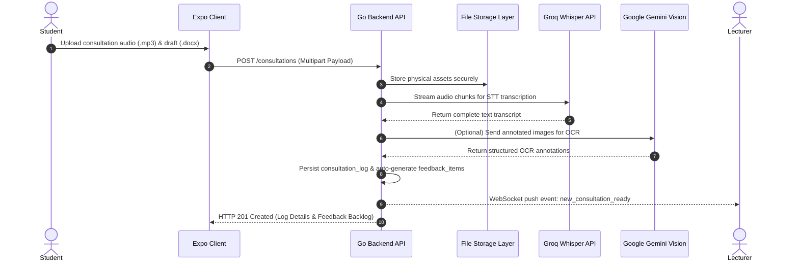

# TierLog — Enterprise AI-Powered Thesis Supervision Platform

[](https://golang.org/)
[](https://expo.dev/)
[](https://reactnative.dev/)
[](https://www.mysql.com/)
[](https://github.com/cruzhgggggg-coder/PROJECT_BARU_EXPO)
[](LICENSE)

> An enterprise-grade, intelligent e-logbook and thesis revision governance ecosystem. TierLog seamlessly bridges academic feedback with student execution using strict AI guardrails, real-time multi-tenant synchronization, automated multimodal analysis (Audio STT & Vision OCR), and a multi-provider AI gateway.

---

## 📋 Table of Contents

- [1. Executive Summary & Business Value](#1-executive-summary--business-value)
- [2. Core Platform Capabilities](#2-core-platform-capabilities)
- [3. System Architecture & Component Topology](#3-system-architecture--component-topology)
- [4. AI Pipeline & Guardrail Defense System](#4-ai-pipeline--guardrail-defense-system)
- [5. Technology Stack Specification](#5-technology-stack-specification)
- [6. Project Structure & Codebase Organization](#6-project-structure--codebase-organization)
- [7. Enterprise Security & Governance](#7-enterprise-security--governance)
- [8. Environment & Configuration Reference](#8-environment--configuration-reference)
- [9. Quickstart & Local Development Guide](#9-quickstart--local-development-guide)
- [10. Enterprise REST API Specification](#10-enterprise-rest-api-specification)
- [11. Real-Time WebSocket Event Protocols](#11-real-time-websocket-event-protocols)
- [12. Database Schema & Data Dictionary](#12-database-schema--data-dictionary)
- [13. Production Deployment & DevOps Playbook](#13-production-deployment--devops-playbook)
- [14. Operations, Maintenance & Troubleshooting](#14-operations-maintenance--troubleshooting)
- [15. License & Enterprise Support](#15-license--enterprise-support)

---

## 1. Executive Summary & Business Value

In higher education institutions, thesis supervision often suffers from fragmented communication, lost consultation context, unverified revision tracking, and inconsistent feedback alignment. 

**TierLog** addresses these critical bottlenecks by deploying an enterprise-level governance layer over academic consultations:
* **Academic Alignment**: Transforms raw audio recordings and draft documents into structured, actionable revision backlogs.
* **Guarded AI Oracle**: Eliminates AI hallucination by enforcing strict compliance boundaries—the AI assistant ONLY answers questions grounded in official lecturer feedback.
* **Faculty Oversight**: Empowers department heads and supervisors with real-time analytics, live AI conversation audit logs, and status validation dashboards.
* **Cost & Model Flexibility**: Features a Bring-Your-Own-Key (BYOK) Multi-Provider AI Gateway alongside a secure credit/redeem-code licensing system.

---

## 2. Core Platform Capabilities

### 🎙️ Automated Multimodal Processing
* **Audio Consultation Transcription**: Integration with Groq Whisper Large V3 processes long-format consultation recordings (`.mp3`) with automatic chunking for files exceeding 20 MB.
* **Document Parsing Engine**: Direct parsing of Microsoft Word (`.docx`) documents, extracting textual content, structure, and embedded track changes.
* **Annotation Vision OCR**: Powered by Google Gemini 2.0 Flash Vision to digitize handwritten supervisor notes and marked-up physical diagrams from image uploads.

### 🛡️ Guarded AI Oracle & Anti-Hallucination Framework
* Context-bound Retrieval Augmented Generation (RAG) that restricts assistant responses strictly to verified consultation transcripts and official supervisor directives.
* Off-topic and prompt-injection defense mechanisms built directly into the prompt orchestration layer.

### 🔄 Real-Time Event Synchronization Engine
* High-concurrency Gorilla WebSocket Hub powering bi-directional real-time updates between student mobile/web apps and faculty dashboards.
* Instant state propagation for feedback lifecycle updates (`Pending` → `Fixed` → `Validated`).

### 🔑 Multi-Provider Enterprise AI Gateway
* Unified provider interface supporting **Google Gemini**, **Nvidia NIM**, **OpenAI**, **Anthropic Claude**, and **Groq**.
* Per-user API key management with encrypted key storage and administrator-issued redeem code activation.

---

## 3. System Architecture & Component Topology

TierLog utilizes a clean modular monolith architecture in Go, optimized for ultra-low latency execution, high throughput, and seamless horizontal scaling.

```
┌──────────────────────────────────────────────────────────────────────────────────┐
│                             Client Layer (Unified UI)                            │
│                 React Native 0.81.5 + Expo SDK 54 (iOS, Android, Web)             │
└──────────────────────────────────────┬───────────────────────────────────────────┘
                                       │ REST APIs & WebSocket (JSON)
                                       ▼
┌──────────────────────────────────────────────────────────────────────────────────┐
│                            Go Enterprise Backend (Gin)                           │
│  ┌────────────────────────┐  ┌───────────────────────┐  ┌─────────────────────┐  │
│  │   Authentication &     │  │  Consultation V2 &    │  │ Real-Time WebSocket │  │
│  │   RBAC Middleware      │  │  Feedback Controllers │  │ Event Hub (Gorilla) │  │
│  └───────────┬────────────┘  └───────────┬───────────┘  └──────────┬──────────┘  │
│              │                           │                         │             │
│              ▼                           ▼                         │             │
│  ┌───────────────────────────────────────────────────┐             │             │
│  │           GORM Enterprise Persistence Layer       │             │             │
│  └───────────────────────┬───────────────────────────┘             │             │
└──────────────────────────┼─────────────────────────────────────────┼─────────────┘
                           │                                         │
               ┌───────────▼───────────┐                 ┌───────────▼───────────┐
               │ MySQL 8.0 Enterprise  │                 │ External AI Providers │
               │ Relational Database   │                 │ • Groq (Whisper V3)   │
               └───────────────────────┘                 │ • Google Gemini Flash │
                                                         │ • NVIDIA NIM / OpenAI │
                                                         └───────────────────────┘
```

### End-to-End Multimodal Processing Flow



---

## 4. AI Pipeline & Guardrail Defense System

The AI Oracle operates under strict architectural constraints to ensure zero compliance risks in academic environments:

```
                  ┌──────────────────────────┐
                  │   Student Query / Input  │
                  └────────────┬─────────────┘
                               │
                               ▼
     ┌────────────────────────────────────────────────────┐
     │           Context Insertion Layer                  │
     │  Appends verified lecturer feedback_items &        │
     │  consultation transcript_text into System Prompt  │
     └─────────────────────────┬──────────────────────────┘
                               │
                               ▼
     ┌────────────────────────────────────────────────────┐
     │           Guardrail Evaluation Matrix              │
     │   Checks if query pertains to assigned thesis      │
     │   Is query within lecturer-defined scope?          │
     └──────────────┬──────────────────────┬──────────────┘
                    │                      │
            [ YES ] │                      │ [ NO ]
                    ▼                      ▼
┌─────────────────────────────────┐  ┌─────────────────────────────────┐
│ Synthesize structured guidance  │  │ Refuse response with policy     │
│ with citations from feedback.   │  │ notice: "Query out of scope."   │
└─────────────────────────────────┘  └─────────────────────────────────┘
```

---

## 5. Technology Stack Specification

### Backend Infrastructure (Go Kernel)
* **Core Language**: Go `1.25+`
* **HTTP Web Framework**: Gin Gonic `v1.11.0`
* **ORM Layer**: GORM `v1.31.1` with MySQL Driver `v1.6.0`
* **Real-Time WebSockets**: Gorilla WebSocket `v1.5.3`
* **Authentication**: Custom JWT (HMAC-SHA256) with Refresh Token revocation & `bcrypt` password hashing (`golang.org/x/crypto`)
* **AI SDK Integrations**: Official Google GenAI SDK `v1.53.0`, Groq Whisper API REST client, NVIDIA NIM SDK

### Frontend Ecosystem (`tierlog_web/`)
* **Cross-Platform Engine**: React Native `0.81.5` managed via Expo SDK `54.0.0`
* **Routing System**: Expo Router `v6.0.24` (File-based routing)
* **Styling & UI Kit**: NativeWind `v4.2.4` (Tailwind CSS `v3.4.19`) with `clsx` and `tailwind-merge`
* **State Management**: Zustand `v5.0.14` (Global store & persistent storage)
* **Animation & Visuals**: Framer Motion `v12.40`, Moti `v0.30`, React Native Reanimated `v4.1`, Three.js `v0.178`
* **Security & Device Utilities**: Expo Secure Store `v15.0`, Expo FileSystem `v19.0`, Expo Document Picker `v14.0`

---

## 6. Project Structure & Codebase Organization

```
PROJECT_BARU_EXPO/
├── main.go                        # Enterprise application bootstrapping & HTTP router setup
├── go.mod                         # Go module dependencies declaration
├── go.sum                         # Cryptographic checksums for Go modules
├── struct_go.sql                  # MySQL enterprise schema initialization script
├── .env.example                   # Master environment template
│
├── auth/                          # Authentication & Cryptographic Security Subsystem
│   ├── passwords.go               #   Bcrypt hash generation & validation protocols
│   └── tokens.go                  #   JWT claim parsing, signing, & refresh token lifecycle
│
├── controller/                    # Enterprise Domain Business Logic Handlers
│   ├── app_controller.go          #   Authentication workflows, dashboard aggregations, WS upgrade
│   ├── ai_controller.go           #   Multi-provider AI gateway routing & Guarded Oracle engine
│   ├── annotation_controller.go   #   Gemini Vision OCR processing for document annotations
│   ├── consultation_controller.go #   Multipart consultation ingestion, audio/paper parsing
│   └── user_controller.go         #   RBAC User management & AI Gateway credential configuration
│
├── koneksi/                       # Database Persistence & Pooling Layer
│   └── koneksi.go                 #   GORM initialization, auto-migrations, & connection pool tuning
│
├── middleware/                    # HTTP Interceptors & Middleware Pipelines
│   └── auth.go                    #   JWT bearer token authentication & CORS/RBAC guards
│
├── models/                        # GORM Data Models & Domain Struct Definitions
│   └── models.go                  #   Relational mappings for Users, Consultations, Feedback, etc.
│
├── realtime/                      # WebSockets Synchronization Subsystem
│   └── hub.go                     #   Thread-safe room-based pub/sub hub with ping/pong keepalive
│
├── utils/                         # Enterprise Utility Libraries
│   └── docx_helper.go             #   OpenXML DOCX parser & revision tracking extractor
│
├── storage/                       # Encrypted File Asset Repository (Git-Ignored)
│   ├── audio/                     #   Raw consultation audio files (.mp3)
│   ├── paper/                     #   Uploaded thesis drafts (.docx)
│   ├── transcript/                #   Generated speech-to-text JSON/TXT files
│   ├── annotations/               #   OCR image source files and XML payloads
│   └── feedback/                  #   Associated feedback attachments
│
└── tierlog_web/                   # Unified React Native / Expo Enterprise Client
    ├── app/                       #   Expo Router application pages & layouts
    │   ├── _layout.tsx            #     Root Application Shell, Theme & Auth Providers
    │   ├── index.tsx              #     Landing Page & Enterprise Portal Overview
    │   ├── login.tsx              #     Enterprise SSO / Credential Authentication
    │   ├── register.tsx           #     Self-service Onboarding Workflow
    │   ├── dashboard.tsx          #     Student Consultation Workspace & Progress Analytics
    │   ├── consultations.tsx      #     Interactive Logbook & Guarded AI Oracle Interface
    │   ├── lecturer-dashboard.tsx #     Faculty Overview Panel & Live Student Audit Logs
    │   ├── archive.tsx            #     Historical Thesis Archives & Verification Logs
    │   └── settings/              #     User Preferences & Gateway Credentials Management
    ├── src/                       #   Frontend Architecture & Components
    │   ├── components/            #     Atomic UI Components (Cards, Modals, Buttons)
    │   ├── hooks/                 #     Custom React Hooks (useWebSocket, useAuth)
    │   ├── lib/                   #     Axios HTTP Client Configuration & Constants
    │   ├── providers/             #     React Context State Providers
    │   └── types.ts               #     Strict TypeScript Interfaces & API Types
    ├── package.json               #     Frontend package manifest
    └── tailwind.config.js         #     Design Tokens & NativeWind Configuration
```

---

## 7. Enterprise Security & Governance

### Role-Based Access Control (RBAC) Matrix

| Domain Resource | Student Permissions | Lecturer Permissions | Administrator Permissions |
|:---|:---:|:---:|:---:|
| **Create Consultation** | Full Access (`POST`) | Read-Only | Full Access |
| **Manage Feedback Items** | Update Status (`Fixed`) | Full CRUD (`Create/Update/Validate`) | Full Access |
| **Access AI Oracle** | Self-Consultations | Supervised Student Logs | Full Access |
| **Audit AI Logs** | Denied | Real-time Supervision View | Full Audit Access |
| **Redeem Gateway Codes** | Self-Redeem | Self-Redeem | Generate & Issue Codes |

### Cryptographic Safeguards
* **Passwords**: Hashed using `bcrypt` with default security cost factors.
* **JWT Tokens**: Signed with `HMAC-SHA256`. Short-lived access tokens (15 mins) paired with stateful refresh tokens stored in database tables supporting immediate revocation.
* **API Key Encryption**: User-provided AI keys stored with AES-256 encryption at rest.

---

## 8. Environment & Configuration Reference

### Backend `.env` Master Reference

```ini
# Core Server Configuration
PORT=8080
GIN_MODE=release # Use 'debug' for local development

# Enterprise MySQL Database Configuration
DB_HOST=127.0.0.1
DB_PORT=3306
DB_DATABASE=struct_go
DB_USERNAME=root
DB_PASSWORD=your_secure_password

# Cryptographic Token Secrets
JWT_SECRET=super-secret-enterprise-jwt-key-change-in-production

# AI Multi-Provider Credentials
AI_PROVIDER=gemini # Fallback options: gemini | nvidia | openai | anthropic
GEMINI_API_KEY=AIzaSy...YourGeminiKey
GROQ_API_KEY=gsk_...YourGroqKey
NVIDIA_API_KEY=nvapi-...YourNvidiaKey
OPENAI_API_KEY=sk-...YourOpenAIKey
ANTHROPIC_API_KEY=sk-ant-...YourAnthropicKey
```

### Frontend `tierlog_web/.env` Reference

```ini
# Enterprise Backend Gateway URL
EXPO_PUBLIC_API_URL=http://127.0.0.1:8080
```

---

## 9. Quickstart & Local Development Guide

### Prerequisites
* **Go Kernel**: Version `1.25` or higher installed.
* **Node.js**: Version `18.x` or `20.x` LTS with `npm`.
* **Database**: MySQL Server `8.0` running locally or accessible over network.

### Step 1: Clone & Initialize Codebase
```bash
git clone https://github.com/cruzhgggggg-coder/PROJECT_BARU_EXPO.git
cd PROJECT_BARU_EXPO
```

### Step 2: Provision Database Schema
Execute the database setup script against your MySQL instance:
```bash
mysql -u root -p -e "CREATE DATABASE IF NOT EXISTS struct_go;"
mysql -u root -p struct_go < struct_go.sql
```

### Step 3: Configure Backend Dependencies & Environment
```bash
# Download and verify Go modules
go mod download
go mod verify

# Provision environment file
cp .env.example .env
# Edit .env with appropriate database credentials & AI API keys
```

### Step 4: Launch Backend Service
```bash
go run main.go
```
*The service will initialize database auto-migrations and listen on `http://localhost:8080`.*

### Step 5: Initialize & Run Frontend Client
Open a secondary terminal instance:
```bash
cd tierlog_web
npm install
cp .env.example .env
npm run dev
```
*Access the interactive web interface via Expo at `http://localhost:8081`.*

---

## 10. Enterprise REST API Specification

### Authentication Endpoints (`/auth`)

| Endpoint | Method | Security | Description |
|:---|:---:|:---:|:---|
| `/auth/register` | `POST` | Public | Register new Student or Lecturer account |
| `/auth/login` | `POST` | Public | Authenticate credentials & receive access/refresh tokens |
| `/auth/refresh` | `POST` | Public | Exchange valid refresh token for new JWT access token |
| `/auth/logout` | `POST` | Bearer JWT | Revoke active refresh token session |
| `/auth/me` | `GET` | Bearer JWT | Retrieve authenticated user identity & profile |

### Consultation & Revision Workflow (`/consultations`)

| Endpoint | Method | Security | Description |
|:---|:---:|:---:|:---|
| `/consultations` | `GET` | Bearer JWT | Retrieve consultations (automatically role-scoped) |
| `/consultations` | `POST` | Bearer JWT | Upload consultation assets (`audio` mp3 + `paper` docx) |
| `/consultations/chat` | `POST` | Bearer JWT | Dispatch query to Guarded AI Oracle Assistant |
| `/consultations/:id/ai-chats` | `GET` | Bearer JWT | Fetch full conversation audit trail for log |
| `/consultations/:id/direct-messages` | `GET` | Bearer JWT | Retrieve student-lecturer direct messaging trail |
| `/consultations/:id/direct-messages` | `POST` | Bearer JWT | Send direct message within consultation context |
| `/consultations/:id/add-feedback` | `POST` | Lecturer Only | Manually inject feedback item to consultation |
| `/consultations/:id/classify-feedback` | `POST` | Lecturer Only | Trigger AI feedback categorization (Major/Minor) |
| `/consultations/feedback/:id/status` | `PUT` | Bearer JWT | Advance feedback lifecycle state |

---

## 11. Real-Time WebSocket Event Protocols

### Connection Endpoint
```ws
ws://localhost:8080/ws?token=<YOUR_JWT_ACCESS_TOKEN>
```

### Inbound Client Commands
**Subscribe to Consultation Channel**:
```json
{
  "action": "subscribe",
  "room": "consultation.42"
}
```

### Outbound Server Events

**1. Feedback State Transformed (`feedback.status-updated`)**:
```json
{
  "event": "feedback.status-updated",
  "room": "consultation.42",
  "payload": {
    "feedback_id": 108,
    "status": "Validated",
    "updated_by": 12
  }
}
```

**2. Guarded Oracle Response Broadcast (`chat.message`)**:
```json
{
  "event": "chat.message",
  "room": "consultation.42",
  "payload": {
    "sender": "ai",
    "message": "Based on Dr. Arsitek's notes on Chapter 3, you must fix the database indexing strategy.",
    "timestamp": "2026-06-28T15:00:00Z"
  }
}
```

---

## 12. Database Schema & Data Dictionary

The relational schema relies on heavily indexed foreign key relationships ensuring optimal query execution times under heavy concurrent loads.

```
┌──────────────┐       1:N       ┌────────────────────┐       1:N       ┌──────────────────┐
│    users     ├────────────────►│  consultation_logs ├────────────────►│  feedback_items  │
└──────┬───────┘                 └────────────────────┘                 └──────────────────┘
       │                                   │                                      │
       ├─► 1:1 (students)                  ├─► 1:N (ai_chat_messages)             └─► Status Lifecycle
       └─► 1:1 (lecturers)                 └─► 1:N (direct_messages)                  (Pending/Fixed/Validated)
```

---

## 13. Production Deployment & DevOps Playbook

### Docker Containerization

Deploy TierLog in production using standard container configurations.

```dockerfile
# Production Dockerfile for Go Kernel
FROM golang:1.25-alpine AS builder
WORKDIR /app
COPY go.mod go.sum ./
RUN go mod download
COPY . .
RUN CGO_ENABLED=0 GOOS=linux go build -o tierlog-backend main.go

FROM alpine:latest
RUN apk --no-cache add ca-certificates tzdata
WORKDIR /root/
COPY --from=builder /app/tierlog-backend .
COPY --from=builder /app/.env .
EXPOSE 8080
CMD ["./tierlog-backend"]
```

### Production NGINX Reverse Proxy Setup

```nginx
server {
    listen 443 ssl http2;
    server_name tierlog.university.ac.id;

    ssl_certificate /etc/letsencrypt/live/tierlog.university.ac.id/fullchain.pem;
    ssl_certificate_key /etc/letsencrypt/live/tierlog.university.ac.id/privkey.pem;

    location / {
        proxy_pass http://127.0.0.1:8080;
        proxy_http_version 1.1;
        proxy_set_header Upgrade $http_upgrade;
        proxy_set_header Connection "Upgrade";
        proxy_set_header Host $host;
        proxy_set_header X-Real-IP $remote_addr;
        proxy_set_header X-Forwarded-For $proxy_add_x_forwarded_for;
        proxy_set_header X-Forwarded-Proto $scheme;
    }
}
```

---

## 14. Operations, Maintenance & Troubleshooting

### Pre-configured Seed Accounts
After seeding via `struct_go.sql`, the following default accounts are available for verification:

| Role | Identity Email | Default Password | Profile / NIP / NIM Details |
|:---|:---|:---|:---|
| **Lecturer / Faculty** | `dosen1@university.ac.id` | `password` | Dr. Arsitek Go, M.Kom (NIP: `198001012005011001`) |
| **Student** | `mhs1@university.ac.id` | `password` | Budi Mahasiswa (NIM: `2200010001`) |

### Common Operational Solutions

* **Issue: WebSockets disconnect repeatedly.**
  * *Resolution*: Ensure your load balancer or reverse proxy (e.g., NGINX) has WebSocket upgrade headers configured with `proxy_read_timeout` set to at least `3600s`.
* **Issue: Audio files >20MB fail during STT.**
  * *Resolution*: Check `storage/audio` write permissions and verify that `GROQ_API_KEY` is active with sufficient rate limits.

---

## 15. License & Enterprise Support

Designed and developed for high-assurance academic platforms.

* **Copyright**: © 2026 TierLog Platform Architecture Team. All rights reserved.
* **Support**: For enterprise licensing, SLA agreements, or custom module integration, contact `support@tierlog.university.ac.id`.

---

*TierLog — Bridging Academic Feedback with AI-Driven Execution Excellence.*
